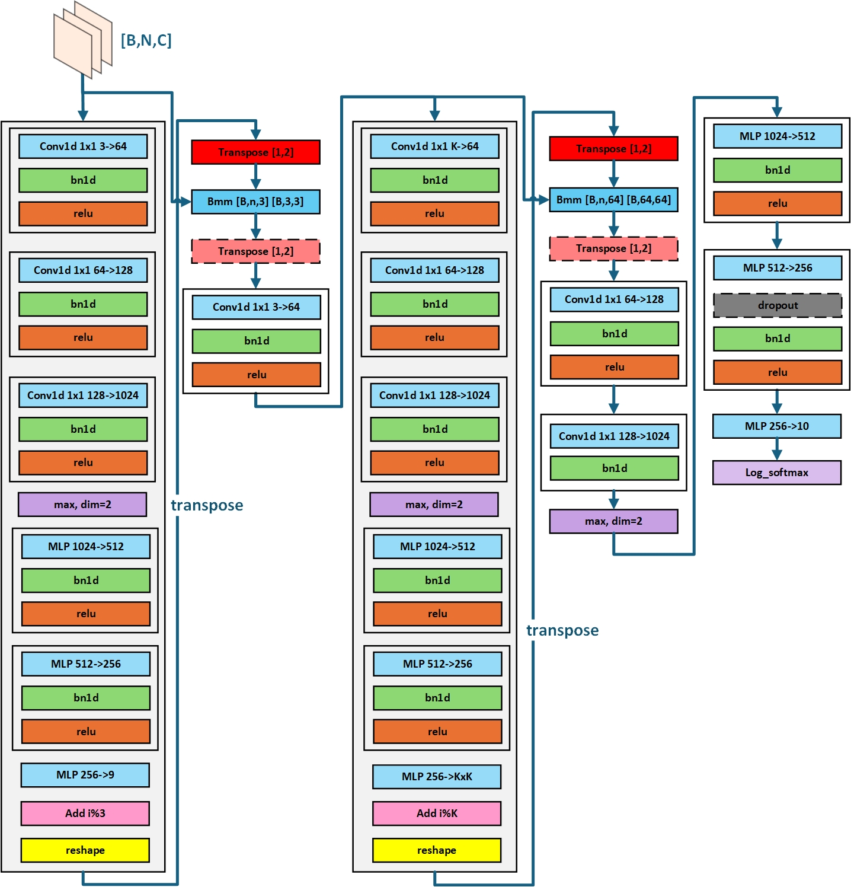

### Brief
This gym aims to implement [`PointNet`](https://arxiv.org/abs/1612.00593)

### Instruction

`run.sh` helps to download dataset and unzip default parameters

`/cuda_learn` the cuda version, includes all single file cuda code

`/cuda_learn` the triton version, includes all single file triton code

### Model structure

Layers:

### Tasks
1. implement PointNet inference in `CUDA`
    #### shape
    1. Transpose
    #### calculate
    1. `Conv1d` kernel $1\times 1$(implemented by MLP)
    2. `MLP`
    3. `BatchedGemm`
    4. `BatchNorm1d`
    5. `ReLU`
    6. `Add identity matrix`
    
    fuse bias and activate into gemm

    `BatchNorm1d` can be preprocessed：$\frac{x_{bni}-mean_i}{\sqrt{var_i+\epsilon}}\times w_i + b_i=x_{bni}\times \alpha_i + \beta_i, \left\{\begin{aligned}
    &\alpha_i = \frac{w_i}{\sqrt{var_i+\epsilon}}\\
    &\beta_i = -\alpha_i \times mean_i+b_i
    \end{aligned}\right.$
    #### reduction
    1. `max`
    2. `log_softmax`
    ### precision
    + fp32：v1-v4
    + fp16：v6-v7
    ### optimize
    1. . Memory Coalescing： This is when multiple threads access consecutive memory addresses **at the same time**, and the hardware can merge these memory accesses into a single burst, allowing for the entire set of data to be retrieved in one go, rather than having to wait for serial bursts from multiple threads.
        + Vectorized Memory Access 
    2. Gemm Optimization:
        + Data Prefetching(Pipeline), which is equivalent to forming a pipeline, overlapping the delay of memory access and computation
        + Register Blocking, dividing the accumulation and addition of multiple one-dimensional vector products into multiple blocks to prevent bank conflicts + Tensor Core(fp16)

    3. Optimizations for Reduce:
        + Tree shaping
        + shfl function (not implemented) 

    4. Calculation
        + Combining multiple operators: MM+BN+ReLU
        + Preprocessing BN
        + frsqrt function
    ### test
    + V100
    + Ubuntu 20.04
    + Results:
    ```
        inference latency(s):accuracy
        v1: 
        5.4053:0.8110 
        v2: 
        2.7829:0.8110 
        v3: 
        2.1196:0.8110 
        v4: 
        1.5529:0.8110 
        v6: 
        0.5097:0.8180 
        v7: 
        0.28034:0.7240
    ```
    + v1-v4 more fuse and more special
    + v6-v7 MMA based Tensor Core (fp16)
2. implement PointNet inference in [`Triton`](https://triton-lang.org/main/index.html)

    [Tritorch](https://github.com/Asuka0630/tritorch.git) is a repo implemented layers/functions in triton by overriding 
    `forward` and `backward`

    If you don't understand backpropagation, the derivation can be referred to the section [backpropgation](./backpropgation.md).
